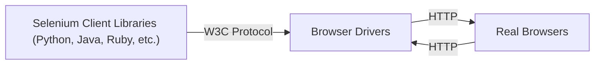

### Arquitectura de Selenium Webdriver 

Explicación:  

El cliente WebDriver traduce los comandos de tu script en solicitudes HTTP, siguiendo el protocolo W3C WebDriver.  

¿Por qué el protocolo W3C WebDriver?  
Todos los navegadores modernos (Chrome, Firefox, Safari, Edge) son compatibles de forma nativa con el protocolo W3C, lo que garantiza un comportamiento consistente.  

Estas solicitudes HTTP se envían a los controladores de los navegadores.  

¿Qué es un controlador de navegador?  
Cada navegador (Chrome, Firefox, Safari, etc.) tiene su propio controlador dedicado.  
Este controlador es un pequeño programa que actúa como un traductor entre el protocolo WebDriver y el propio navegador.  

Finalmente, los controladores de los navegadores interpretan las solicitudes HTTP y controlan los navegadores web reales, ejecutando las acciones definidas en los scripts de prueba (abrir páginas, hacer clic en botones, completar formularios, etc.).  

El navegador ejecuta los comandos y devuelve la respuesta al controlador.  

- Resumen:  
Después de que inicies la prueba, el código completo de Selenium (Cliente) que hemos escrito se convertirá al formato JSON.  
El JSON generado se envía al controlador del navegador (Servidor) a través del protocolo HTTP.
Nota: Cada navegador tiene su propio controlador de navegador.  
Los controladores de navegador se comunican con su respectivo navegador y ejecutan los comandos interpretando el JSON que han recibido en el navegador.  
El controlador del navegador recibe las respuestas del navegador y envía la respuesta en formato JSON de vuelta al cliente.  